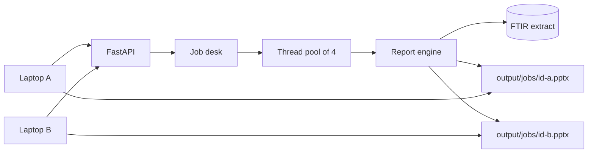

# FTIR web app architecture

People on different laptops open the same service, each builds a report under their own name, and each downloads a separate PowerPoint. One user’s file never replaces another user’s file.

## Python version

**Python 3.14.7, 64-bit Windows**, plus Node.js 24 to build the React page. After `npm run build`, the offline PC only needs Python.

## Shape

```text
Laptop browser
    |
    |  HTTP
    v
FastAPI  (backend/main.py, port 8000)
    |-- React build in frontend/dist
    |-- Job desk in backend/jobs.py
    |-- Report engine in backend/engine.py
            |
            +-- data/records.csv  (or ftir_dataset.csv / .db)
            +-- output/jobs/<id>.pptx
```



## What each part does

| Piece | Role |
|---|---|
| `frontend/` | React page. Name, status, KPI cards, charts, insights, and the download button. |
| `backend/main.py` | HTTP API and, after the React build, the page itself. |
| `backend/jobs.py` | One job per request. A token stays in the browser that created the job. |
| `backend/engine.py` | Same cleaning, KPIs, insights, and editable PowerPoint charts as the notebook. |
| `data/` | Shared read-only extract. Loaded once when the server starts. |
| `output/jobs/` | One `.pptx` per job id. |

The notebook `ftir_kpi_report.ipynb` still runs on its own. The web app does not call the notebook.

## Multi-user behavior

1. The browser sends `POST /api/reports` with a name.
2. The server creates a random id and a secret token, then returns both only to that browser.
3. A background thread builds the deck and writes `output/jobs/<id>.pptx`.
4. The browser polls `GET /api/reports/{id}` with header `X-Report-Token`.
5. Download uses the same header. A laptop without the token gets 404, so the activity list can show names without handing out files.
6. Up to four reports build at once. Extra requests wait in the queue.
7. The process keeps the latest 40 finished jobs and deletes older files.

The server dataset is only read. An uploaded CSV is saved under `output/uploads/` and used only by the job that received it. Each thread writes its own presentation object and its own path.

## API

| Method | Path | Purpose |
|---|---|---|
| GET | `/api/health` | Dataset loaded, row count, how many jobs are running |
| GET | `/api/activity` | Recent names and statuses, no tokens and no download links |
| POST | `/api/reports` | Start a report. Multipart form: `name`, and an optional `file` CSV. The CSV is used only for that job. |
| GET | `/api/reports/{id}` | Status, KPIs, chart series, insights. Requires the token header |
| GET | `/api/reports/{id}/download` | That user’s `.pptx`. Requires the token header |

## Run it

On a machine with internet, once:

```text
python -m pip install -r requirements.txt
cd frontend
npm install
npm run build
cd ..
```

Then, including on the offline PC after `python install_offline.py` and a copied `frontend/dist`:

```text
python run_web.py
```

Open `http://<this-pc>:8000` from each laptop. Port 8000 must be reachable on the LAN.

For UI work while coding, run the API and the Vite dev server together. Vite on port 5173 proxies `/api` to port 8000.

```text
python run_web.py
cd frontend && npm run dev
```

## What is not in this version

There is no login account and no database of users. Identity is the name typed on the page plus the token stored in that browser’s session. Restarting the server clears in-memory jobs; files left in `output/jobs/` are not listed until someone builds again.
